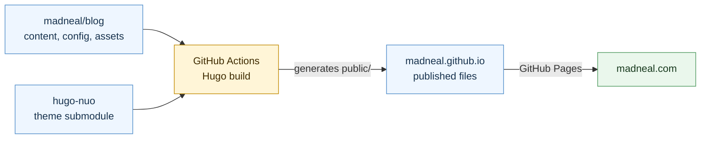

# blog

## Architecture

`madneal/blog` is the source repository. It keeps the posts, Hugo configuration,
layout overrides, static files, and the `hugo-nuo` theme pointer. GitHub Actions
builds the site into `public/`, then publishes that generated output to
`madneal/madneal.github.io` for GitHub Pages to serve at `madneal.com`.

## Deployment

Pushing to `master` runs GitHub Actions to build the Hugo site and publish `public/`
to `madneal/madneal.github.io`.

The source repository needs a `GH_PAGES_TOKEN` secret with permission to push to
`madneal/madneal.github.io`.

The Hugo theme is tracked as a submodule from `madneal/hugo-nuo`, so theme
changes can be maintained independently from the blog content.
