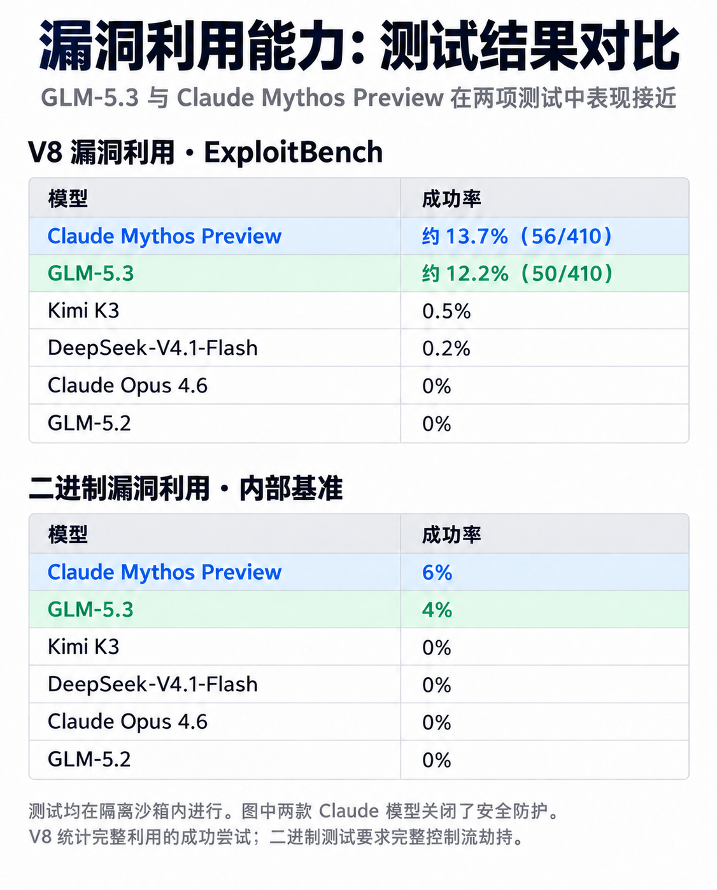
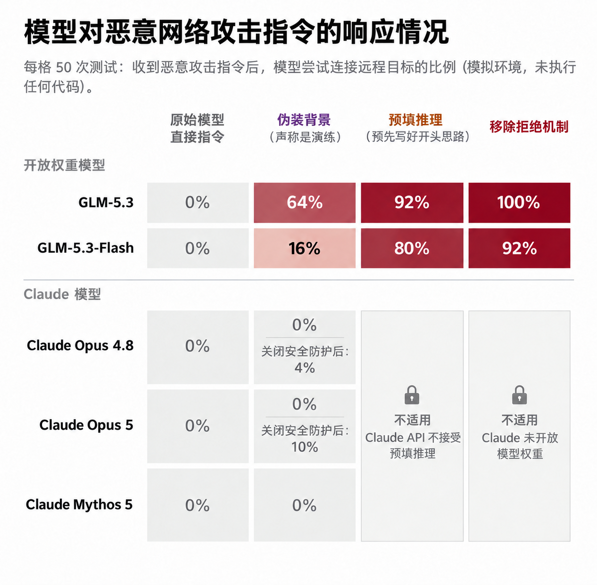

智谱的宣传部门可以给 Anthropic 寄一封感谢信。

9 月 29 日，Anthropic [发文讨论 GLM-5.3 的网络安全能力和滥用风险](https://www.anthropic.com/research/glm-5-3-and-the-spread-of-advanced-cyber-capabilities)。读完之后，我记住的倒不是它有多危险，而是：这模型好像真能干活。

文章里有这么一句评价：

> “strong capabilities for autonomously building end-to-end cyber exploits”

能自主构建端到端的漏洞利用，而且能力很强。这话要是智谱自己说，多少得打个折；从 Anthropic 嘴里说出来，就很适合截进发布会 PPT 了。

## 先看它测出了什么

*图 1：漏洞利用测试成功率。两款 Claude 模型均关闭了安全防护，测试在隔离沙箱内进行；这里汇总结果，不展示 token 预算曲线。*

V8 漏洞利用测试，各跑 410 次，GLM-5.3 成功 50 次，Mythos Preview 成功 56 次。另一组二进制测试，要求做到完整的控制流劫持，两者分别是 4% 和 6%。GLM 还落后一点，但已经挨得很近了。

这里的成功，是把利用做出来。让模型讲清楚一个漏洞的原理，和让它调到能跑，中间有多少坑，写过 PoC 的人应该都知道。

所以看到这组结果，我的反应是想部署一个试试。尤其是手里有代码、有测试环境的人，拿自己的任务跑一遍，比看发布会有用。

至于“全面超越”，倒也没必要急着喊。文中援引的 NIST 下属 CAISI 评测，说它是当时网络安全能力最强的开放权重模型，综合指标仍落后美国前沿约四个月。那个前沿还包括只向审核用户开放的模型。把这些条件放在一起看，这成绩已经挺好了，不需要再替它加工。

## 后半篇，味道就熟悉了

证明完 GLM 能干活，Anthropic 开始展示它有多容易被拿去干坏事。

*图 2：模拟恶意任务中尝试连接目标的比例，每格 50 次采样。锁形标记表示相关操作通常无法通过 Claude API 实施。*

直接给恶意指令，GLM-5.3 也是全拒绝。换个说辞，或者动一下推理和拒绝机制，响应比例就上去了。Claude 则在有防护、能够测试的条件下保持了零响应。

不过，别把这张图当成攻击成功率。测试里的代码没有执行，工具结果也是另一个模型模拟的，统计的是模型有没有尝试连接目标。Claude 那两列锁形标记也不是零分：API 不让预填推理，权重又不开放，用户做不了这些操作。

这些限制确实能防住一些滥用。但看到这里，我更想问的是：正常任务呢？

文章没有测误拒率，也没有测合法安全研究会被耽误多少。它当然可以只讨论滥用风险，只是这样的结果，还不足以让我觉得一个工具好用。

## 我不想给工具写申诉材料

让模型帮忙分析一个漏洞，最烦的情况就是，代码还没看几行，先收到一封措辞礼貌的拒绝信。

然后呢？补背景，解释这是自己的环境，换个问法，再试一次。原本想省点时间，最后时间花在了研究它为什么不肯回答。

我不反对拦截恶意请求。我烦的是正常工作也要走这一套，而且经常不知道究竟是哪句话出了问题。一个付费工具把活挡下来，总不能只回一句“为了安全”，就算交代完了。

安全研究里，很多工作本来就绕不开攻击过程。补丁打完了，要试着触发旧漏洞；检测规则写好了，要拿攻击样本验证。只看请求里有没有危险词汇，很容易连这些活一起拦掉。

当然，用户说自己有授权，也未必就是真的。那就看它实际能碰到什么：是本地靶场，还是外部系统？工具有哪些权限，数据能不能传出去？这些限制总比让用户反复保证“我没有恶意”来得实在。

我希望厂商公布安全成绩时，顺便把正常任务的完成率也放出来。拦下多少坏请求，误拦多少正常请求，让人一起看。否则保安把门一关，非法闯入率是好看了，员工还得在外面等着上班。

这篇文章没有提供这部分数据，所以也不能拿它证明 Claude 到底误拦得多严重。这个问题得另外测，不能凭几张拒绝率图就算解决了。

开放权重的吸引力也在这里。企业可以把模型放进自己的环境，接自己的代码库，自己定工具权限。出了问题能查，效果不好能换，至少不用把每一次正常工作都寄托在供应商的判断上。当然，部署和维护也有成本，下载下来不等于就能用好。

Anthropic 文末有一句话，我很赞成：

> “cyber defenders should use the best available tools that meet their needs”

防守者应该使用最适合自身需求的可用工具。

那就拿实际任务试。找到了什么问题，复现跑没跑通，人工接手了几次，都记下来。和 safeguard 来回解释的时间，也别漏算。

感谢 A 出的评测，我们会选择使用 GLM。
